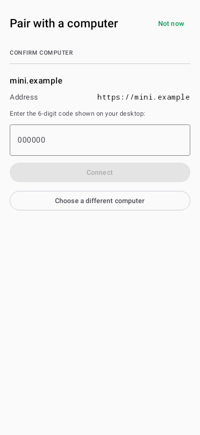
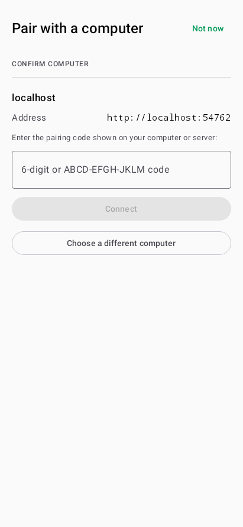
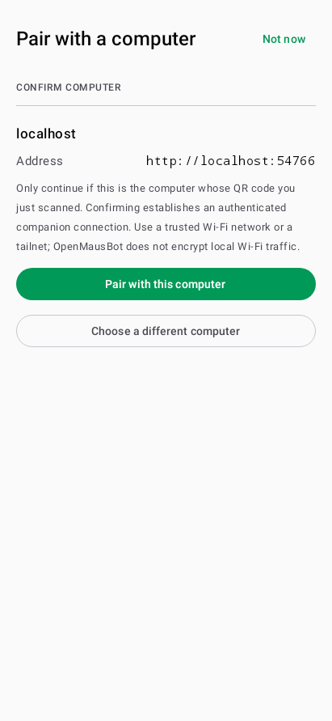

# Android server QR pairing

Android now accepts the `/pair#code=…` links printed by `openmausbot serve`
and `openmausbot pair`, as well as the existing desktop companion QR format.
A scan fills a confirmation screen; no request is sent until the user confirms.
The manual form also accepts the server's twelve-character code.

Run from `android/`, with the Android SDK and JDK configured:

```sh
./gradlew :core:test :app:testDebugUnitTest :app:assemblePreview
```

For focused checks:

```sh
./gradlew :core:test --tests '*Server*PairingTest' \
  :app:testDebugUnitTest --tests '*ServerPairingScreenTest'
```

The core tests cover link validation, exact origin retention, credential-free
identity preflight, server redemption, persisted identity/scopes, separate
bearer storage, server refusals, idempotent retry after a lost response,
replaced server rejection, inactive-server shares and refused descriptor redirects.
Legacy desktop companion links and stored connections remain supported.

`ServerPairingScreenTest` mounts the real Compose pairing screen and Session
against a disposable loopback server. It injects decoded QR content through
the same invite receiver used by the scanner, confirms that scanning makes no
network requests, taps confirmation, and checks the `/api/auth/pair` request
and saved connection. It also types a server code and retries a 503 with the
same code and attempt id. It does not exercise camera hardware or QR decoding.

From the repository root, the existing server contract suite launches its own
isolated harness and verifies pairing, bearer access, event streams and revocation:

```sh
pnpm exec vitest run server/remote-sessions.test.ts
```

Never pair a verification build with the user's live workspace. For a physical
camera check, generate the code from a disposable server and scan that code
inside the Android app. This change does not register arbitrary HTTPS links
with Android's system link handler.

## Local verification — 2026-09-18

- 553 core tests and 917 app tests passed with no failures or skips.
- The three pairing-screen tests also passed with native graphics enabled.
- `:app:assemblePreview` succeeded; the APK's v2 signature verified.
- All 19 `server/remote-sessions.test.ts` tests passed against the isolated harness.
- `pnpm typecheck` passed.
- A second code review found no remaining actionable findings after the retry,
  inactive-share and redirect regressions were added.

The screenshots are real Robolectric renders: the baseline is from main at
`0c327bca`, and the updated form and server confirmation are from this change.
The differing addresses are disposable fixtures.

| Before | After |
| --- | --- |
|  |  |



### Repository-wide checks

`pnpm test` was not fully green: Vitest completed with 7,348 passing tests,
2 failures, 60 skipped and 1 todo. The failure in
`server/delta-context.e2e.test.ts` (delegate source session replay, line 963)
reproduced in a pristine worktree at base `0c327bca`. The Electron case in
`server/local-computer-proxy.test.ts` timed out in the full run but passed
when rerun on both pristine main and this patch. Neither server test nor its
implementation is changed here.

Because that failure stopped the chained command, the remaining stages were
run separately: broker tests (9 passed), Electron node tests (347 passed,
3 skipped), and the packaged-server smoke all passed. Lint and locale checks
also passed. This records the baseline failure; it does not waive or claim a
green repository-wide suite.
